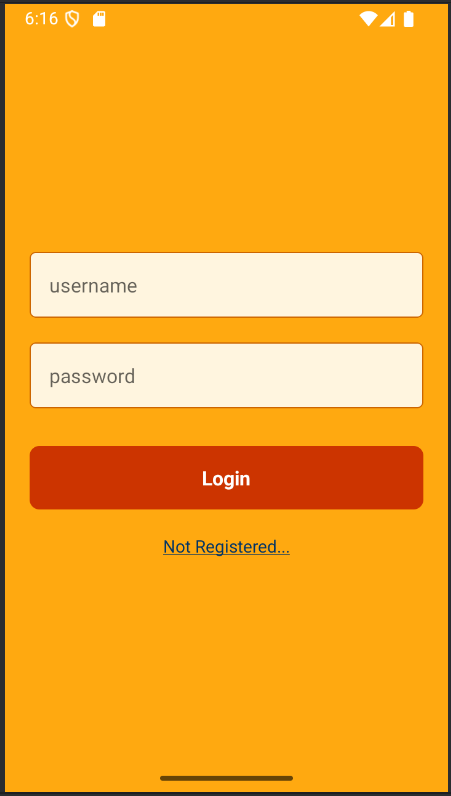
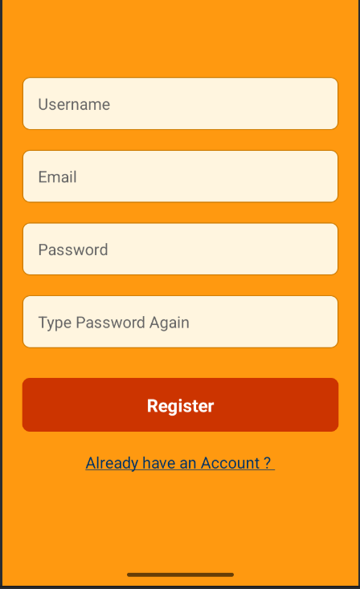
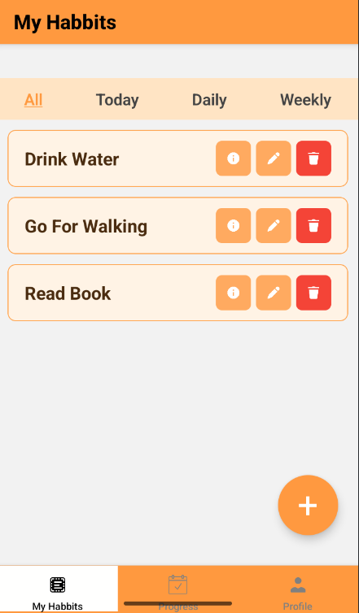
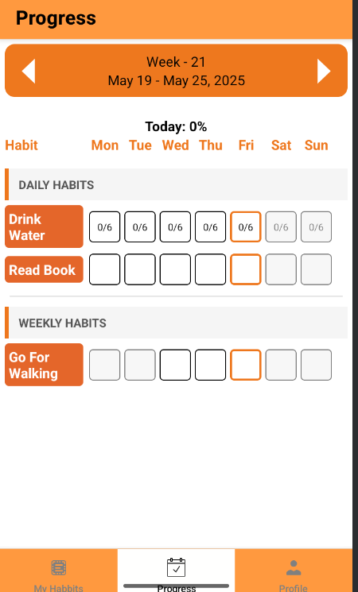
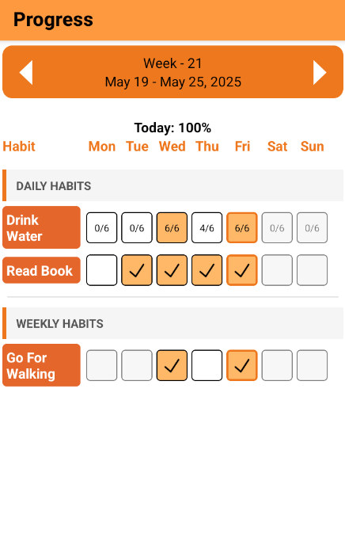
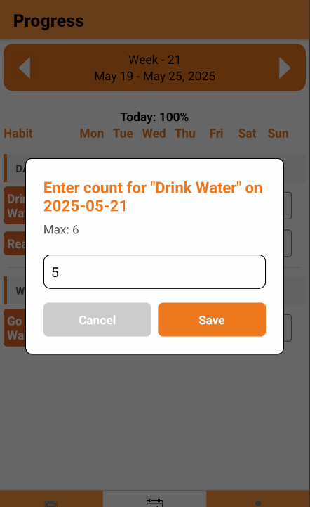
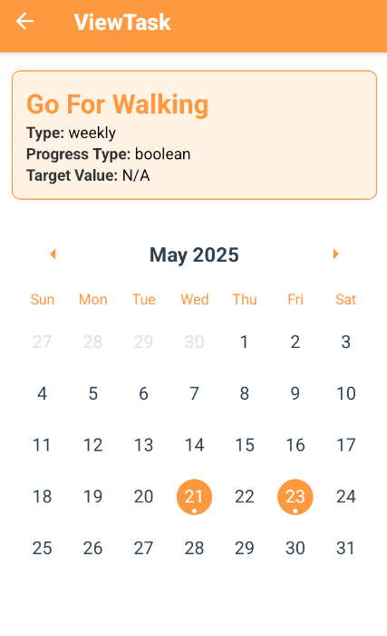

# Habit Tracker - Mobile Application

A simple and intuitive habit tracking mobile application that helps users build and maintain healthy habits with daily tracking options. The app supports two types of habits: **boolean (Yes/No)** and **count-based** (numeric value).

---

##  Features

- Create and manage habits
- Track daily progress
- Boolean habits: mark as done/not done
- Count-based habits: input progress (e.g., drink 8 glasses of water)
- Weekly view to monitor past performance
- View task details
- Edit or delete tasks

---

## Built With

- **React Native**
- **TypeScript**
- **Zustand** – for state management
- **React Navigation**
- **AsyncStorage** – for optional local data persistence

---

## Screenshots

| | | |
|---|---|---|
|  |  |  |
|  |  |  |
|  |  |  |
---

## Demo Video

[Watch Demo](src/readmefiles/habit-tracker.mp4)

---

## Installation

```bash
git clone "https://github.com/vipusrihar/habit_tracker.git"

cd habit_tracker

npm install

npx react-native run-android
 ```
